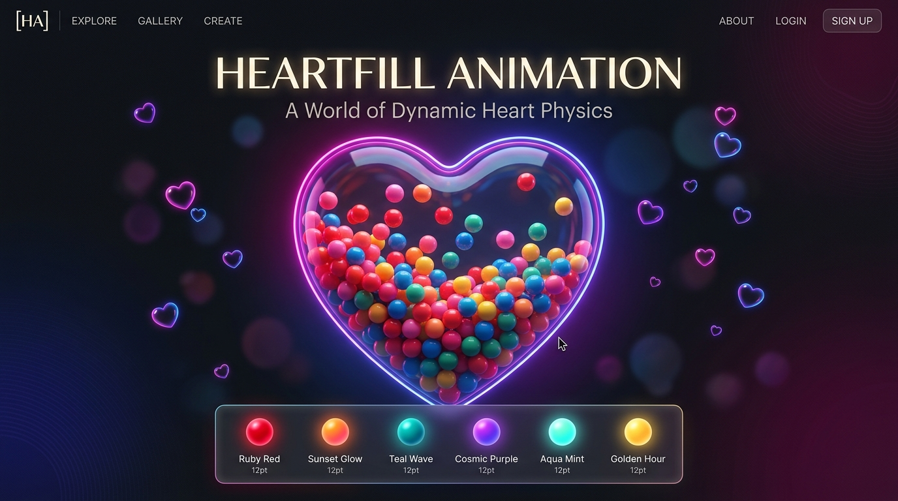

# 💖 Heartfill Animation

A stunning 2D visual animation built with HTML, CSS, JavaScript, and Matter.js physics engine. Featuring a central heart filled with animated physics spheres, floating heart bubbles, an expressive text overlay, and a customizable glassmorphic theme switcher.



🔗 **[View Live Demo](https://heartanimation-v1.netlify.app/)**

---

## ✨ Features

- 💗 **Interactive Central Heart**: Matter.js 2D physics simulation of colorful spheres filling a heart container.
- 🎨 **Glassmorphic Theme Switcher**: 5 aesthetic color themes accessible via a sleek floating control bar:
  - **Midnight Glow**: Classic deep purple, magenta, and pink neon vibes.
  - **Golden Sunset**: Warm amber, peach, coral, and rose-gold lighting.
  - **Cyberpunk Love**: Electric cyan, ultraviolet, and hot neon magenta.
  - **Emerald Enchantment**: Mystic emerald green, mint, and jade tones.
  - **Velvet Passion**: Rich crimson, ruby red, and dark burgundy.
- 🔄 **Live Recoloring**: Real-time updates to background atmosphere, text glow, floating heart bubbles, and physics particles upon theme selection.
- 💾 **Persistent Preference**: Automatically saves your active theme choice in `localStorage`.
- 📝 **Expressive Text Overlay**: Elegant typography overlay with glowing pulse animation.
- 📱 **Fully Responsive**: Optimized for desktop and mobile viewports.

---

## 🛠 Tech Stack

- **HTML5** & **CSS3** (Custom Properties, Glassmorphism & Keyframe Animations)
- **JavaScript (ES6+)**
- **[Matter.js](https://brm.io/matter-js/)** (2D Physics Engine)
- **pathseg** & **poly-decomp** (SVG Path Decomposition)

---

## 🚀 How to Run Locally

1. **Clone the repository:**
   ```bash
   git clone https://github.com/erickdc7/heartfill-animation.git
   ```
2. **Navigate into the project folder:**
   ```bash
   cd heartfill-animation
   ```
3. **Open `index.html` in your web browser:**
   Simply double click `index.html` or serve using Live Server.
